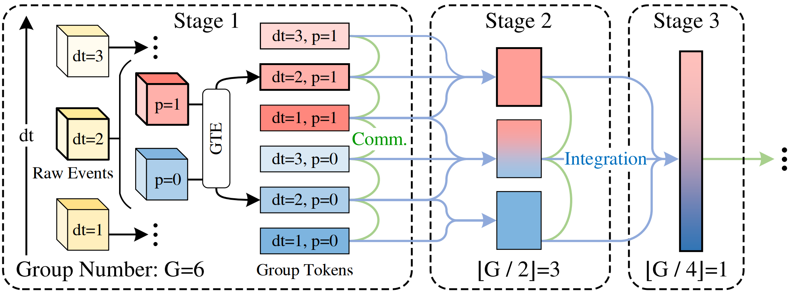

# ICCV2023:<br /> "GET: Group Event Transformer for Event-Based Vision"

## Installations
```Bash 
conda create -y -n get python=3.11 pip
conda activate get
pip install torch torchvision torchaudio --index-url https://download.pytorch.org/whl/cu117
pip install timm yacs spikingjelly termcolor opencv-python 
```

## Required Data
CIFAR10DVS: Auto downloading.<br />
DVS128Gesture: Download files manually and put files at [datasets/dvs128gesture/download].<br />
Others: Just follow the spikingjelly instructions to download other datasets if needed.

## Training
Parameters such as batch size can affect performance.<br />
(in relation to dataset size, learning rate, and data augmentation)<br /> 
Exercise caution when making modifications.

**DVS128Gesture**
```Bash
python -m torch.distributed.launch --nproc_per_node 8 --master_port 23333 main.py --use_env \
--use-checkpoint --batch-size 64 --epoch 1000 --embed_split 48 --group_num 24 \
--patch_size 4 --lr 0.0008 --data-path datasets/dvs128gesture --cfg configs/GET/GET_48.yaml
```
**CIFAR10DVS**
```Bash
python -m torch.distributed.launch --nproc_per_node 8 --master_port 23333 main.py --use_env \
--use-checkpoint --batch-size 64 --epoch 1000 --embed_split 24 --group_num 12 \
--patch_size 4 --lr 0.001 --data-path datasets/cifar10dvs --cfg configs/GET/GET_48.yaml
```

## Evaluation
**DVS128Gesture**
**top-1 acc 97.9%**
```Bash
python -m torch.distributed.launch --nproc_per_node 1 --master_port 23333 main.py \
--use_env --batch-size 64 --embed_split 48 --group_num 24 --patch_size 4 \
--data-path datasets/dvs128gesture --cfg configs/GET/GET_48.yaml --eval --resume checkpoints/GET_group24_gesture.pth
```
**CIFAR10DVS**
**top-1 acc 84.8%**
```Bash
python -m torch.distributed.launch --nproc_per_node 1 --master_port 23333 main.py \
--use_env --batch-size 64 --embed_split 24 --group_num 12 --patch_size 4 \
--data-path datasets/cifar10dvs --cfg configs/GET/GET_48.yaml --eval --resume checkpoints/GET_group12_cifar.pth
```
## Citing GET
```
@inproceedings{peng2023get,
    title={GET: Group Event Transformer for Event-Based Vision},
    author={Yansong Peng and Yueyi Zhang and Zhiwei Xiong and Xiaoyan Sun and Feng Wu},
    booktitle = {International Conference on Computer Vision (ICCV)},
    year={2023},
}
```
